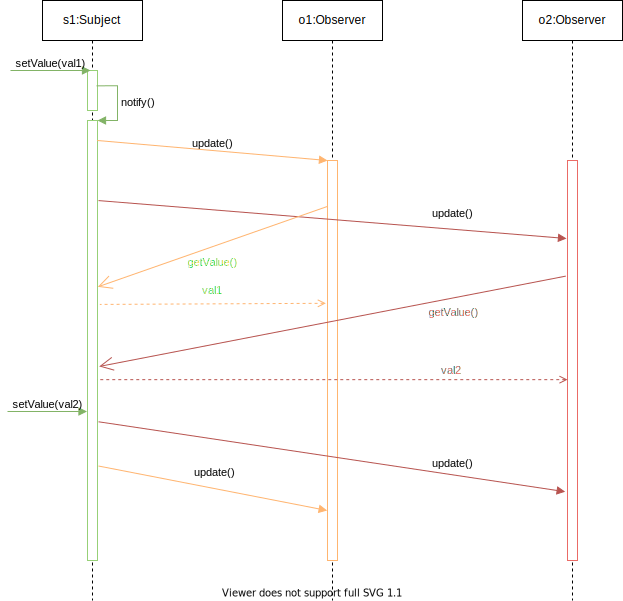

# TD 1

## Question : Que se passe-t-il quand on emploie des appels asynchrones pour ``update()`` et ``getValue()`` ? Faire un diagramme de séquence avec 2 ``Observer``

## Analyse des problèmes de Observer en asynchrone

Si on n'a pas de gestion de cohérence -> bazar complet potentiel, les observers voient des choses différentes.

Solution possible :

- Resynchroniser comme dans la version séquentielle : cohérence atomique
  - (+) on est en terrain connu concernant la gestion des données
  - (-) on gâche totalement les possibilités de parallélisme
  - (-) pas toujours réalisable
- Relâcher la cohérence : différentes concessions à la "consistency"

## Trois modèles de cohérence

Problème des lecteurs rédacteurs...

Ici on a pour ``Observer`` une variable qui est l'attribut valeur du sujet, 1 rédacteur (le mutateur) et N lecteurs (les observers).

Définissons les cohérences dans ce cadre.

Soit V(i) la suite des valeurs écrites dans la variable, V = V_1, V_2, ..., V_x

Soit L(i) la suite des valeurs lues par chaque ``Observer``, O_i : L(i) = L(i)_1, ...

### Cohérence atomique

### Cohérence séquentielle

### Incohérence assistée
