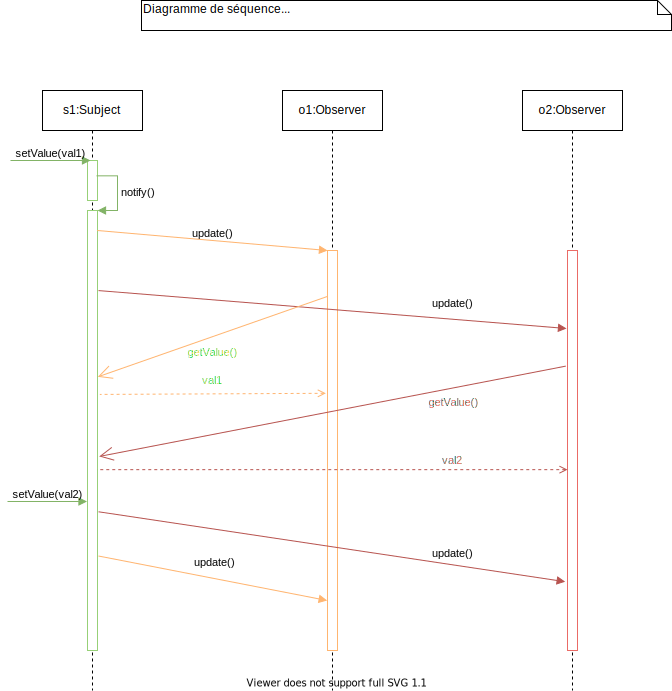
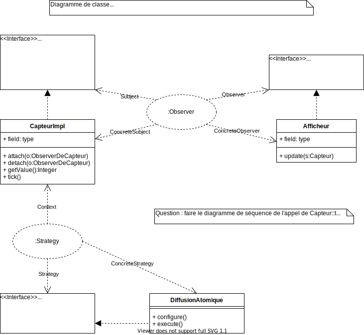
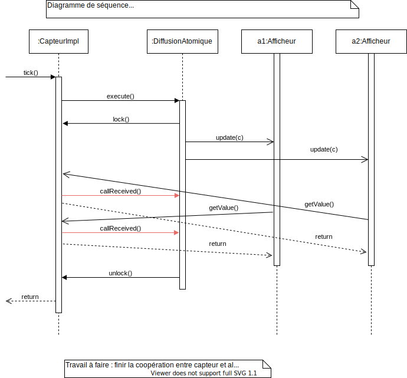

# TD 1 & 2

## Analyse des problèmes de Observer en asynchrone

Si on n'a pas de gestion de cohérence -> bazar complet potentiel, les observers voient des choses différentes.

Solution possible :

- Resynchroniser comme dans la version séquentielle : cohérence atomique
  - (+) on est en terrain connu concernant la gestion des données
  - (-) on gâche totalement les possibilités de parallélisme
  - (-) pas toujours réalisable
- Relâcher la cohérence : différentes concessions à la "consistency"

## Trois modèles de cohérence

Problème des lecteurs rédacteurs...

Ici on a pour ``Observer`` une variable qui est l'attribut valeur du sujet, 1 rédacteur (le mutateur) et N lecteurs (les observers).

Définissons les cohérences dans ce cadre.

Soit V(i) la suite des valeurs écrites dans la variable, V = V_1, V_2, ..., V_x produit par le mutateur (= rédacteur).

Soit L(i) la suite des valeurs lues par chaque ``Observer``, O_i : L(i) = L(i)_1, ...

### Cohérence atomique

#### Définition de atomique

Pour tout i : L(i) = V

#### Réalisation (comment faire)

On va faire une alternance rédacteurs/lecteurs.

1. Initialement le rédacteur peut écrire dans la variable (= mutateur peut modifier le sujet, un appel à ``setValue(v_i)``)
2. A la fin de l'écriture, la phase de lecture commence.
3. Pendant la phase de lecture, toute écriture est interdite.
4. Lorsque tous les lecteurs on lu une fois (par appel à ``getValue()``) la phase de lecture termine et la phase d'écriture commence.

### Cohérence séquentielle

#### Définition de séquentielle

1. Pour tout i : L(i) est une sous-suite de V
2. Pour tout i : L(i) = L ; une seule sous-suite autorisée -> tous les lecteurs (``Observer``) voient la même chose.

Avantage par rapport à la cohérence atomique : on ne bloque pas le mutateur (pas d'exclusion mutuelle entre lecteurs et rédacteur).
Inconvénient : on perd des valeurs produites par le rédacteur.

#### Réalisation (comment faire)

1. Les lecteurs lisent une copie de la variable.
2. Le mutateur écrit dans l'original, sans exclusion mutuelle.
3. Au début d'une phase de lecture, on copie l'original dans la variable copie et les ``getValue()`` retournent la valeur de la copie.
4. Lorsque tous les lecteurs ont lu une fois, la phase de lecture est finie : pendant la phase de lecture la copie est "gelée".

En d'autres termes : une variable pour le rédacteur, une autre pour les lecteurs ; la cohérence atomique de la copie.

### Incohérence (assistée)

#### Définition de causale

1. Pour tout i : L(i) est une sous-suite de V

#### Implémentation de causale

1. On utilise un mécanisme d'horloge (estampille).
2. Au moment de l'écriture de la valeur V_i, la valeur est estampillée avec i.
3. Lors d'une lecture, un lecteur reçoit la valeur courante de la variable, avec son estampille.
4. Si la valeur reçue est plus ancienne que celle précédement reçue, on ne garde que la plus récente (au sens des estampilles, = celle qui a l'estampille la plus élevée).

## (M1) Question : Que se passe-t-il quand on emploie des appels asynchrones pour ``update()`` et ``getValue()`` ? Faire un diagramme de séquence avec 2 ``Observer``

## Diagrammes

### (M1) Diagramme de classe

### (M1) Diagramme de séquence Capteur::Tick

