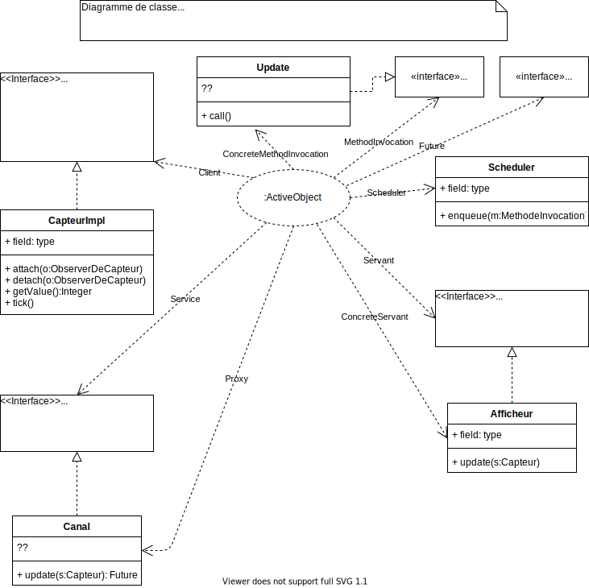
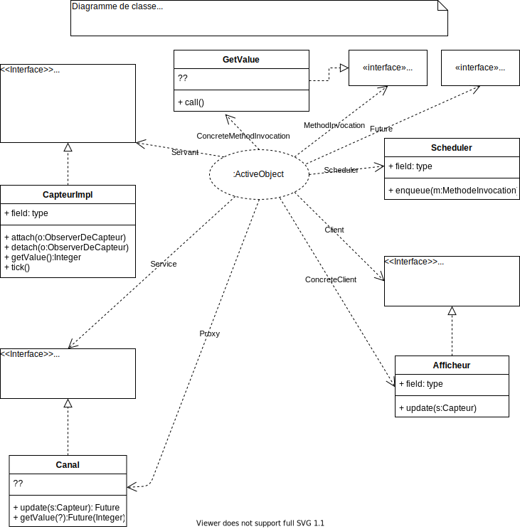
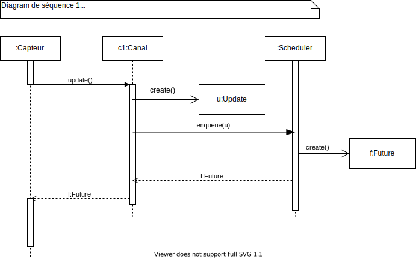
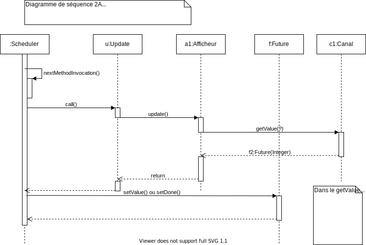
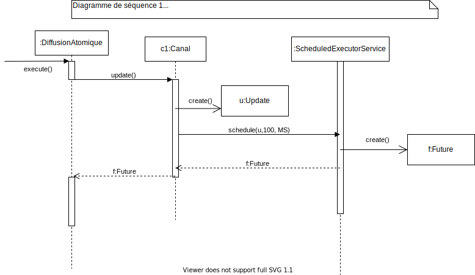
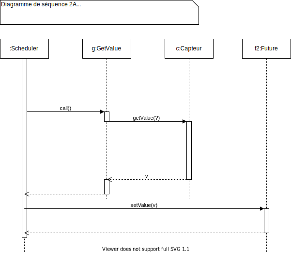
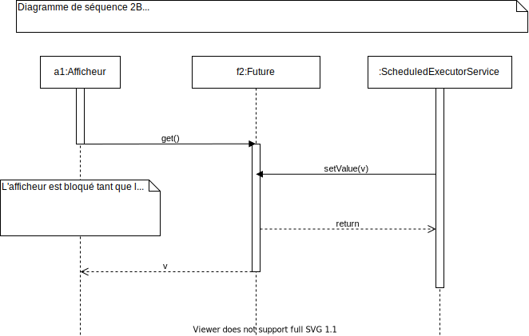

# TD 3

## Résumé des épidoes précédents

- Patterns ``Observer``, ``Strategy``, ``Proxy`` dans un contexte d'exécution asynchrone -> modèle M1
- Application du ``PC Active Object`` pour passer de M1 (asynchrone natif) au modèle M2 (pas d'asynchrone natif, modèle indépendant de la plate-forme)
- Emploi de la plate-forme JDK 8+ pour passer de M2 au modèle M3 : emploi de ``Executor & co``

## Procédé de passage de M1 à M2

1. Trouver l'interface synchrone (Servant) et le client
   - ``ObserverDeCapteur`` (Servant)
   - ``Capteur`` (Client)
2. Définir l'interface asynchrone (rôle Service) à partir de l'interface synchrone
   - ``ObserverDeCapteurAsync`` (Service)
3. Définir un ``Proxy``
   - Pour des raisons de simplification : on a besoin d'un ``Proxy`` pour ``Active Object``, or on a déjà un proxy...
   - On réutilise le Proxy de M1 : ``Canal``, il sera chargé de créer les ``ConcreteMethodInvocation``
4. Définir une ``ConcreteCommandIncovation``
   - classe ``Update`` qui implémente ``MethodInvocation`` 
5. Importer ``MethodInvocation``, ``Scheduler``, ``Future``
6. Faire de diagralle de classe 
7. Faire les diagrammes de séquence 1 (création de la ``MethodInvocation`` -> Client), 2A (exécution asynchrone de la ``MethodInvocation`` -> ``Scheduler``), 2B (resynchronisation avec le ``Future`` -> Client)

Pas tout a fait terminé, on termine tout dans M3.

## Passage de M2 à M3

On emploie le JDK 8+.

(rôle -> type du JDK)

- Scheduler -> ``ScheduledExecutorService``
- MethodInvocation -> ``Callable``
- Future -> ``Future``
- Le reste à coder

Diagram M2 -> M3 (on renomme avec l'utilisation de JDK).

(Strategy ignoré, il faut l'intégrer dans M3)

(Diagram 3 séquence 1, remettre ``Strategy`` c:CapteurImpl (execute()) -> DiffusionAtomique (update()) -> c1:Canal -> ...)

Afficheur appelle ``getValue()`` sur le ``Future`` retourné ``Diagram_Sequence_2B``.

## Conseils de mise en oeuvre

### Classe de configuration (Main)

- Créer le capteur (instance de ``CapteurImpl``)
- Créer 4 canaux de type ``Canal``
- Créer 4 afficheurs, chaque afficheur écrit dans la console (avec Logger.GetGlobal().info(...)) et enregistre dans une liste de valeur reçue
- Connecter tout ça
- Commencer par les cohérences atomique (Pattern Strategy)
- Point important : pas besoin de déclarer Update et GetValue car on a les lambdas
- Pas IHM, à la place un oracle
- Attention à employer sufficament de threads

### Ecriture de l'oracle

Après arrêt de l'exécution (après une 100ène de tick par exemple) :

- Comparaison des traces enregistrées par chaque afficheur
- On ne retient que le plus court préfixe (on prend l'afficheur qui à le moins de valeur, si un 90, un autre 95 et un autre 105, on prend 90 || la longueur la plus courte L parmi les afficheurs)
- Atomique : toutes les traces sont égales à 1, 2, 3, ... L
- Séquentielle : toutes les traces sont croissantes et identique
- A étpoque ou causale : toutes les traces sont strictement croissantes

## Diagrammes

### (M2) Diagramme de classe Update

### (M2) Diagramme de classe GetValue

### (M2) Diagramme de séquence 1

### (M2) Diagramme de séquence 2A

### (M3) Diagramme de séquence 1

### (M3) Diagramme de séquence 2A

### (M3) Diagramme de séquence 2B

