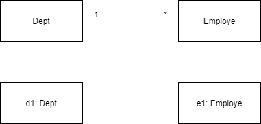
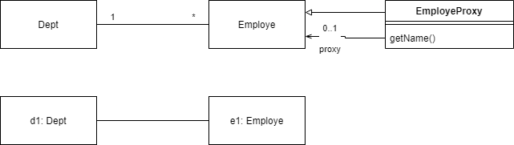
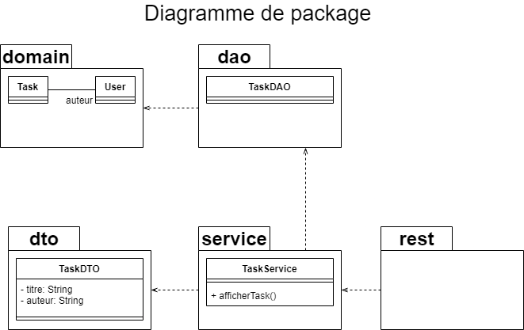
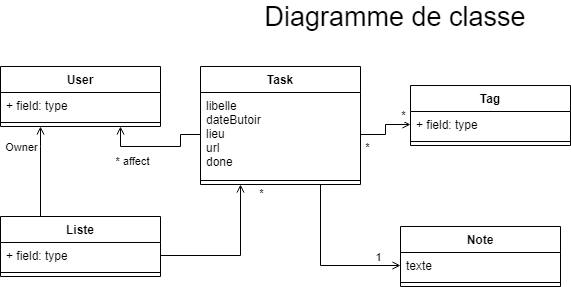

# TAA Examen 2019 - 2020

## Q1 : Lors de la persistance d'un objet o (appel de la méthode em.persist(o)), vousobtenez l'exception suivante. Expliquez le problème. (Exception in thread "main" javax.persistence.RollbackException: Error while commiting the transaction)

Si l'objet est lié à d'autres objets la persistence par défaut ne s'applique pas aux objets liés ce qui provoque l'exception.

Si on a des employés liés a un département :

``em.persist(e1)`` ``em.persist(d1)``

OU

Sur la relation ``OneToMany(cascade = CascadeType.PERSIST, Fetch = FetchType.EAGER)``.



## Q2 : Rappelez le design pattern utilisé pour le chargement paresseux. Expliquez à l'aide de diagrammes d'objets, de classes et de séquence le fonctionnement de ce pattern dans le cas précis du chargement paresseux. Expliquez en quoi la bonne compréhension par le développeur utilisant un framework de Mapping Objet Relationnel du mécanisme de chargement paresseux est important pour conserver de bonnes performances à l’exécution ?

Utilisation d'un pattern proxy, utilisation des instances du proxy.

Revoir cours et compléter



## Q3 : A l’aide d’un diagramme de package UML, représentez la structuration en couches de l’application que vous souhaiteriez mettre en œuvre. Pour quelle raison structure-t-on généralement la partie backend en couche de cette manière là?



La DTO est bien un package à part même si souvent défini directement dans le package service.

## Q4 : Nous souhaitons partir du modèle métier. Proposez un digramme de classe UML pour modéliser la partie métier de cette application. La partie serveur pourra gérer l’ensemble des listes de tâches des utilisateurs et plusieurs listes par utilisateur. 



## Q5 : Implantez deux de ces classes en utilisant JPA.

Utilisation de JPA pour implémenter deux de ces classes.

```Java
@Entity
class Task
{
	@id
	@GeneratedValue
	long id;
	String libelle;
	@Temporal
	Date dateButoir;
	@ManyToMany
	List<Tag> tags;
	@ManyToOne
	Note note;
	@ManyToMany
	User auteur;
	@ManyToMany
	List<User> affect
}
```

```Java
@Entity
class Tag
{
	@id
	@GeneratedValue
	long id;
	@ManyToMany(MappedBy ="tags")
	List<Task> tasks;
}
```

## Q6 : Nous souhaitons ensuite définir une classe de DAO par classe métier. Proposezà l’aide de Spring Data la définition de la DAO pour la classe TodoListItem (ou tout autreclasse de votre modèle métier).

Pour l'injection de dépendance annoter ``@Repository`` qui est un ``@Component`` ce qui permet l'injection de dépendances.

```Java
@Repository
public interface TaskRepository extends JpaRepository<Carte, Long>
{ }
```

## Q7 : Nous souhaitons ajouter à la DAO de l’entité TodoListItem une méthode permettant de récupérer toutes les taches restant à faire  dont la date d’échéance estentre deux dates. Proposez le code JPQL pour cette requête.

Code JPQL:

```SQL
select t from Task as t where t.done and t.dateButoir between ?1 and ?2
```

## Q8 : Nous souhaitons proposer une interface de service en utilisant JaxRS ou les annotations Spring Web. Proposez la mise en place du service gérera la partie TodoItem accessible à l’adresse suivante http://localhost/todos. On se limitera uniquement à mettre en œuvre un service Rest qui retourne un flux JSON de toutes les taches restant à faire dont la date d’échéance est entre deux dates.

Utilisation de JaxRS pour créer un service Rest simple.

```Java
@Path("todos")
public class TaskResources
{
	TaskDAO dao = new TaskDAOImpl();
	
	//avec @POST, on créé une classe DateBetween DTO et
	
	@Get
	@Consumes("application/json")
	@Path("/{debut}/{fin}") // Pas besoin en POST
	List<Task> getAllTask(@PathParam("debut") String debut, @PathParam("fin") String debut)
	{
		Date dateDebut = Date.parse(debut);
		Date dateFin = Date.parse(fin);
		
		return this.dao.getAllTask(dateDebut, dateFin);
	}
}
```

## Q9 : Nous souhaitons ensuite utiliser la programmation par aspects pour tracer tous les appels aux services métiers. Proposez la mise en œuvre de ce service de trace. Uniquement la classe Java et les annotations. Rappelez les avantages à utiliser de l'AOP pour ce type de fonctionnement.

Création d'un aspect avec AspectJ.

```Java
@Aspect
public class Log
{
	@Before("execution(* fr.istic.service.*.*(..))")
	public void logBeforeCall(JoinPoint joinPoint)
    {
        System.out.println("LOGGING: ....");
    }
}
```
